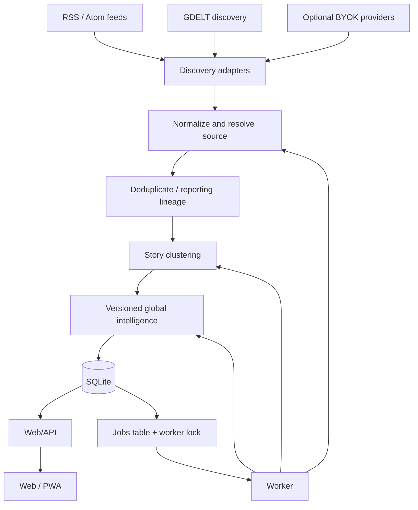

# Architecture

## Decision

Start as a TypeScript modular monolith: Next.js web/API and a single in-process or separately invoked Node worker share `packages/core`, `packages/providers`, and SQLite. This is deliberately for single-instance self-hosting: SQLite removes a separate database service and is simple to back up. A Python intelligence worker is explicitly deferred: its benefits are real only if a mature Python NLP capability demonstrably exceeds the TypeScript path enough to justify operational and contract complexity.

Next.js 16.2 is current as of this planning pass ([release notes](https://nextjs.org/blog/next-16-2)); it supports ordinary Node-server deployment, which keeps self-hosting straightforward. This is not a commitment to a managed platform.

## Boundaries

| Boundary | Responsibility | Not responsible for |
| --- | --- | --- |
| `apps/web` | Server-rendered reading experience, auth/session boundary, API routes, settings | batch ingestion or model runs |
| `apps/worker` | scheduled ingestion, normalization, clustering, bounded analysis jobs | public UI/API contracts |
| `packages/core` | domain rules, schemas, database queries, provenance and security primitives | UI components |
| `packages/providers` | narrowly scoped adapters and normalized inputs | application policy or database access |
| SQLite | canonical relational state, jobs table, FTS5 search | raw publisher-content archive |

Keep provider contracts small and capability-focused: discovery/news, article extraction, LLM, embedding, source rating, fact-check search, and primary-source resolution. Implement an interface only alongside a real adapter; a provider does not receive database access or user secrets except at its narrowly controlled call boundary.

## Execution model

The web process handles short reads/writes. One worker handles feed polling, retries, normalization, clustering, and expensive analysis. A jobs table and an exclusive worker lock are sufficient: do not run concurrent writers. Jobs are idempotent and store attempt/error/provider metadata. Backoff honors provider limits. If an instance genuinely needs multiple active writers or fleet-wide scheduling, provide a documented Postgres migration path rather than supporting two databases from day one.

## Versioning and recomputation

Articles retain acquisition and normalization versions. Clustering stores algorithm/config/model version, score components, and membership decisions. Every generated analysis stores provider/model, prompt/template version, input evidence snapshot, schema version, timestamp, and status. Changing any meaningful method creates a replacement analysis; it never silently rewrites reader-facing provenance.

## Storage and self-hosting

SQLite holds metadata, derived findings, hashes, bounded snippets, and references. Object storage is not needed initially. Full article bodies are transient analysis input by default and should be deleted promptly; an explicit self-host archive mode is later and must make its legal implications clear.

Use SQLite FTS5 first. Store versioned embeddings only after a measured clustering/search need; use bounded in-process similarity over the active corpus initially. Move to a SQLite vector extension or an optional Postgres deployment only when evaluation and scale justify it. No Elasticsearch, Redis, Kafka, Kubernetes, or separate vector store in V1.
