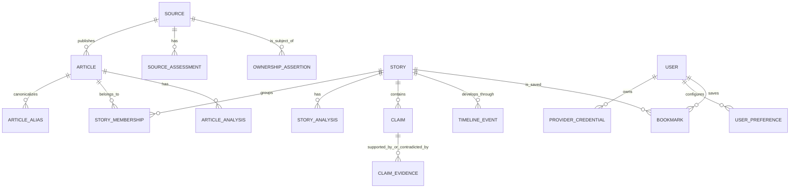

# Conceptual data model

This is a relational model, not migration code. IDs are stable UUIDs; timestamps are UTC; display dates/locales are rendered at the edge. Language uses BCP 47 where known, country uses ISO 3166 where appropriate. Unknown is a real state, not a missing default.

## Identity and content

| Entity | Minimum purpose and fields |
| --- | --- |
| **Source** | Canonical publisher identity: domain(s), name, type, country/region, languages, and source-resolution confidence. Domain aliases are separate records so a source can change domains without losing history. |
| **Article** | Permitted metadata: source, canonical URL, title, author/byline as supplied, published/updated/discovered times, language, region/category hints, short attributed snippet, content/fingerprint hashes, acquisition policy, retention expiry, and canonical/duplicate status. |
| **ArticleAlias** | Alternate URL, canonical relation, normalization reason, source of evidence, observed timestamp. |
| **Acquisition** | Provider/feed ID, external ID, fetch/parse metadata, raw response hash where permitted, rate-limit/job linkage, and errors. This is provenance, not a publisher archive. |

## Story and lineage

| Entity | Minimum purpose and fields |
| --- | --- |
| **Story** | Stable identity, current canonical headline/summary pointers, state (`developing`, `active`, `settled`, `archived`, `superseded`), category/entity/location links, importance/freshness signals, and current analysis pointer. |
| **StoryMembership** | Article/story relation with decision (`automatic`, `reviewed`, `rejected`), score components, algorithm/version, evaluated time, reviewer/correction reference. It makes merges/splits explainable. |
| **ReportingChain** | A tentative independent-origin chain for a story. It groups direct reporting, identified wire copy, and reprints without pretending certainty. `basis`, confidence, and source evidence are mandatory. |
| **OwnershipAssertion** | Source → parent/ultimate owner relationship, ownership type/country, effective dates, confidence, evidence URL/reference, reviewer, and status. Ownership is temporal and often incomplete. |
| **TimelineEvent** | Timestamp/range, event type, neutral description, cited article/primary-source evidence, uncertainty, and analysis version. |

## Assessments and intelligence

| Entity | Minimum purpose and fields |
| --- | --- |
| **SourceAssessment** | Source-level historical orientation axes/context label, reliability characteristics, methodology, evidence, provider/reviewer, confidence band, scope, and reviewed/expiry timestamps. Historical records are never an article verdict. |
| **ArticleAnalysis** | Article-level structured framing/evidence/opinion-vs-reporting analysis. Contains cited spans, schema, model/prompt/version, input snapshot, confidence, and validity state. |
| **StoryAnalysis** | Shared canonical summary, agreed facts, uncertainty, coverage/framing findings, and cited evidence set. One active version may be displayed, but all versions remain auditable. |
| **Claim** | Atomic, attributable proposition; exact normalized text, claim type, scope/time, extraction provenance, and a discrete verification status. Opinions/predictions are explicitly non-fact-checkable. |
| **ClaimEvidence** | Claim → primary document, data, court/legislative filing, article, or fact-check-result link; relationship is `supports`, `contradicts`, `context`, or `mentions`; include quoted permitted span, retrieval time, strength rationale, and provenance. Supporting and contradicting evidence are never collapsed into one score. |
| **AnalysisRun** | Cross-cutting immutable record for model/provider/template/schema/input hash/cost/timing/error. Other analysis records point to it. |

## User and secret data

| Entity | Minimum purpose and fields |
| --- | --- |
| **User** | Account identity and deletion state. Keep profile optional and minimal. |
| **UserPreference** | Topics/regions/source choices, explicit ranking controls, display/privacy settings, and consent/version. Reading behavior is opt-in and separately retained. |
| **ProviderCredential** | User/provider ID, encrypted credential envelope, key identifier/version, masked suffix/display label, endpoint policy reference, test timestamp/status, and deletion timestamp. Never store plaintext or return the encrypted value to a client. |
| **Bookmark/Follow** | User ↔ story/topic relation, created time, notification preference. |

## Constraints and indexes

- Unique normalized canonical URL per resolved article identity; retain aliases separately.
- Index article discovery/publication time, source + publication time, story state + importance/freshness, and memberships by story/article.
- Unique active assessment per source/methodology/scope/version only if the methodology permits; preserve historical superseded records.
- Claim evidence is unique by claim/evidence/relation/span hash to prevent repeated signals inflating support.
- Use database constraints for status enums, required provenance references, and user ownership. Use SQLite FTS5 before any vector index; enforce a single-writer worker lock around write-heavy ingestion.
